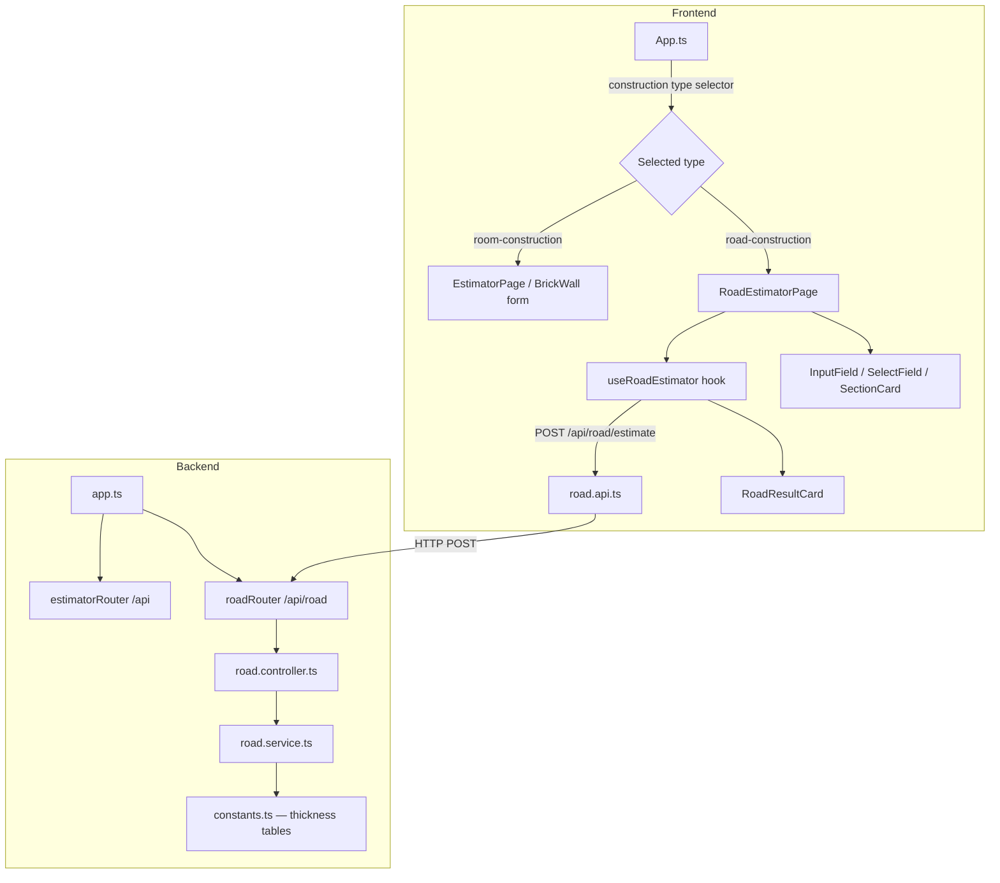

# Design Document: Road Construction Estimator

## Overview

The Road Construction Estimator extends the existing ConstroQuant application with a second estimator mode alongside the Brick Wall Estimator. Users select "Road Construction" from the top-level construction-type selector, fill in pavement type, traffic category, soil type, road length, and road width, and receive a complete layer-thickness breakdown plus procurement-ready material quantities.

The feature follows the same architectural pattern already established in the codebase:

- **Backend**: a dedicated service (`road.service.ts`) performs all calculations; a controller validates inputs; a router registers the new `POST /api/road/estimate` endpoint.
- **Frontend**: a page component (`RoadEstimatorPage.ts`) renders the form using existing `InputField`, `SelectField`, and `SectionCard` primitives; a hook (`useRoadEstimator.ts`) manages form submission and state; a result card (`RoadResultCard.ts`) displays the output.

The existing Brick Wall Estimator is untouched. The only modification to existing files is:
1. `App.ts` — adds the road estimator branch to the construction-type switch.
2. `EstimatorPage.ts` — adds `Road Construction` to the selector options.
3. `useEstimator.ts` — adds a `road-construction` branch that mounts the road form.
4. `backend/src/config/constants.ts` — adds road thickness lookup tables and calculation constants.
5. `backend/src/app.ts` — registers the new road router.

---

## Architecture



**Key design decisions:**

- **Separate router file** (`road.routes.ts`) keeps road concerns isolated and avoids modifying the existing `estimator.routes.ts`.
- **Separate service file** (`road.service.ts`) keeps calculation logic independent; the brick wall service is not touched.
- **Thickness tables in `constants.ts`** — a single source of truth for all lookup data, consistent with how `BRICK_WALL_CONSTANTS` is stored today.
- **Frontend hook pattern** — mirrors `useEstimator.ts`; the road hook is self-contained and does not interfere with the brick wall hook.

---

## Components and Interfaces

### Backend

#### `road.routes.ts`
```
POST /api/road/estimate  →  road.controller.estimateRoad
```

#### `road.controller.ts`
Validates the five required fields (`pavementType`, `trafficCategory`, `soilType`, `roadLength`, `roadWidth`), delegates to `road.service.calculateRoad`, and returns the structured JSON response or a 400 error.

#### `road.service.ts`
Pure calculation module. Exports a single function:
```typescript
calculateRoad(input: RoadInput): RoadResult
```
Internally:
1. Looks up layer thicknesses from the constants table using the composite key `(pavementType, trafficCategory, soilType)`.
2. Converts thicknesses from mm to metres.
3. Computes layer quantities and raw material procurement quantities using the formulas from Requirements 5–7.
4. Returns a `RoadResult` object.

### Frontend

#### `RoadEstimatorPage.ts`
Renders the full road estimator form inside a `SectionCard`. Contains three sub-sections rendered with `SelectField` and `InputField`:
- Pavement type selector (drives dynamic traffic category options)
- Traffic category + soil type selectors
- Road length + road width inputs

#### `useRoadEstimator.ts`
Manages:
- Dynamic traffic category options based on pavement type selection (clears on pavement type change)
- Form submission → calls `road.api.ts` → renders `RoadResultCard` or error
- Loading state display

#### `RoadResultCard.ts`
Renders the result in two sections matching the `BrickWallResultCard` visual style:
- **Layer Quantities** — one card per layer with thickness (mm) and quantity (m³ or t)
- **Raw Material Requirements** — procurement quantities with units

#### `road.api.ts`
```typescript
calculateRoadEstimate(payload: RoadInput): Promise<RoadResult>
// POST ${API_BASE_URL}/road/estimate
```

#### `roadValidators.ts`
```typescript
parseRoadForm(formData: FormData): { input: RoadInput; errors: RoadValidationError[] }
```
Validates pavement type, traffic category, soil type (non-empty strings), road length and width (positive numbers).

---

## Data Models

### Backend types (`backend/src/types/estimator.types.ts` — additions)

```typescript
export type PavementType = "Bituminous" | "Concrete" | "Gravel";

export type BituminousTrafficCategory = "Low" | "Medium" | "High" | "Heavy Industrial";
export type StandardTrafficCategory   = "Low" | "Medium" | "High";
export type TrafficCategory = BituminousTrafficCategory | StandardTrafficCategory;

export type SoilType = "Strong" | "Medium" | "Weak";

export interface RoadInput {
  pavementType:    PavementType;
  trafficCategory: TrafficCategory;
  soilType:        SoilType;
  roadLength:      number;   // metres
  roadWidth:       number;   // metres
}

// Layer thicknesses (mm)
export interface BituminousThicknesses {
  GSB: number; WMM: number; DBM: number; BC: number;
}
export interface ConcreteThicknesses {
  GSB: number; DLC: number; PQC: number;
}
export interface GravelThicknesses {
  Gravel: number; GSB: number;
}
export type LayerThicknesses =
  | BituminousThicknesses
  | ConcreteThicknesses
  | GravelThicknesses;

// Layer quantities
export interface BituminousLayerQuantities {
  Q_GSB: number;   // m³
  Q_WMM: number;   // m³
  Q_DBM: number;   // tonnes
  Q_BC:  number;   // tonnes
}
export interface ConcreteLayerQuantities {
  Q_GSB:      number;  // m³
  Q_DLC:      number;  // m³
  Q_PQC:      number;  // m³
  Q_Concrete: number;  // m³
}
export interface GravelLayerQuantities {
  Q_Gravel: number;  // m³
  Q_GSB:    number;  // m³
}
export type LayerQuantities =
  | BituminousLayerQuantities
  | ConcreteLayerQuantities
  | GravelLayerQuantities;

// Raw material procurement quantities
export interface BituminousRawMaterials {
  Bitumen_Total:  number;  // tonnes
  Aggregate_DBM:  number;  // tonnes
  Aggregate_BC:   number;  // tonnes
  GSB_Procure:    number;  // m³
  WMM_Procure:    number;  // m³
  DBM_Procure:    number;  // tonnes
  BC_Procure:     number;  // tonnes
}
export interface ConcreteRawMaterials {
  Cement_Final:    number;  // bags (ceiling)
  Sand_Final:      number;  // m³
  Aggregate_Final: number;  // m³
  GSB_Procure:     number;  // m³
}
export interface GravelRawMaterials {
  Gravel_Procure: number;  // m³
  GSB_Procure:    number;  // m³
}
export type RawMaterials =
  | BituminousRawMaterials
  | ConcreteRawMaterials
  | GravelRawMaterials;

export interface RoadResult {
  layerThicknesses: LayerThicknesses;
  layerQuantities:  LayerQuantities;
  rawMaterials:     RawMaterials;
}
```

### Frontend types (`frontend/src/types/estimator.types.ts` — additions)

Mirror the backend types above (same shape, imported by the hook and result card).

### Constants (`backend/src/config/constants.ts` — additions)

```typescript
// Road construction calculation constants
export const ROAD_CONSTANTS = {
  DBM_DENSITY:          2.4,    // t/m³
  BC_DENSITY:           2.4,    // t/m³
  BITUMEN_CONTENT:      0.05,   // fraction by mass
  AGGREGATE_CONTENT:    0.95,   // fraction by mass
  GSB_COMPACTION:       1.25,
  WMM_COMPACTION:       1.20,
  WASTAGE_FACTOR:       1.03,
  GSB_PROCURE_FACTOR:   1.29,   // 1.25 × 1.03
  WMM_PROCURE_FACTOR:   1.24,   // 1.20 × 1.03
  M20_TOTAL_PARTS:      5.5,
  M20_CEMENT_PARTS:     1,
  M20_SAND_PARTS:       1.5,
  M20_AGGREGATE_PARTS:  3,
  CEMENT_BAGS_PER_M3:   30,
};

// Thickness lookup tables (all values in mm)
// Key structure: ROAD_THICKNESS_TABLE[pavementType][trafficCategory][soilType]
export const ROAD_THICKNESS_TABLE = {
  Bituminous: {
    Low: {
      Strong: { GSB: 150, WMM: 200, DBM:  50, BC: 25 },
      Medium: { GSB: 175, WMM: 225, DBM:  60, BC: 30 },
      Weak:   { GSB: 200, WMM: 250, DBM:  75, BC: 40 },
    },
    Medium: {
      Strong: { GSB: 175, WMM: 225, DBM:  60, BC: 30 },
      Medium: { GSB: 200, WMM: 250, DBM:  75, BC: 40 },
      Weak:   { GSB: 225, WMM: 275, DBM:  90, BC: 40 },
    },
    High: {
      Strong: { GSB: 200, WMM: 250, DBM:  75, BC: 40 },
      Medium: { GSB: 225, WMM: 275, DBM:  90, BC: 50 },
      Weak:   { GSB: 250, WMM: 300, DBM: 100, BC: 50 },
    },
    "Heavy Industrial": {
      Strong: { GSB: 250, WMM: 300, DBM: 100, BC: 50 },
      Medium: { GSB: 275, WMM: 325, DBM: 110, BC: 50 },
      Weak:   { GSB: 300, WMM: 350, DBM: 120, BC: 60 },
    },
  },
  Concrete: {
    Low: {
      Strong: { GSB: 100, DLC: 100, PQC: 200 },
      Medium: { GSB: 125, DLC: 125, PQC: 220 },
      Weak:   { GSB: 150, DLC: 150, PQC: 230 },
    },
    Medium: {
      Strong: { GSB: 125, DLC: 125, PQC: 220 },
      Medium: { GSB: 150, DLC: 150, PQC: 250 },
      Weak:   { GSB: 175, DLC: 175, PQC: 280 },
    },
    High: {
      Strong: { GSB: 150, DLC: 150, PQC: 250 },
      Medium: { GSB: 175, DLC: 175, PQC: 280 },
      Weak:   { GSB: 200, DLC: 200, PQC: 300 },
    },
  },
  Gravel: {
    Low: {
      Strong: { Gravel: 100, GSB: 100 },
      Medium: { Gravel: 125, GSB: 100 },
      Weak:   { Gravel: 150, GSB: 100 },
    },
    Medium: {
      Strong: { Gravel: 150, GSB: 125 },
      Medium: { Gravel: 175, GSB: 125 },
      Weak:   { Gravel: 200, GSB: 125 },
    },
    High: {
      Strong: { Gravel: 200, GSB: 150 },
      Medium: { Gravel: 225, GSB: 150 },
      Weak:   { Gravel: 250, GSB: 150 },
    },
  },
} as const;
```

### Frontend constants (`frontend/src/constants/estimator.constants.ts` — additions)

```typescript
export const PAVEMENT_TYPE_OPTIONS = [
  { value: "",            label: "Select pavement type" },
  { value: "Bituminous",  label: "Bituminous Road" },
  { value: "Concrete",    label: "Concrete Road" },
  { value: "Gravel",      label: "Gravel Road" },
];

export const TRAFFIC_CATEGORY_OPTIONS: Record<string, Array<{ value: string; label: string }>> = {
  Bituminous: [
    { value: "",                 label: "Select traffic category" },
    { value: "Low",              label: "Low" },
    { value: "Medium",           label: "Medium" },
    { value: "High",             label: "High" },
    { value: "Heavy Industrial", label: "Heavy Industrial" },
  ],
  Concrete: [
    { value: "",       label: "Select traffic category" },
    { value: "Low",    label: "Low" },
    { value: "Medium", label: "Medium" },
    { value: "High",   label: "High" },
  ],
  Gravel: [
    { value: "",       label: "Select traffic category" },
    { value: "Low",    label: "Low" },
    { value: "Medium", label: "Medium" },
    { value: "High",   label: "High" },
  ],
};

export const SOIL_TYPE_OPTIONS = [
  { value: "",       label: "Select soil type" },
  { value: "Strong", label: "Strong" },
  { value: "Medium", label: "Medium" },
  { value: "Weak",   label: "Weak" },
];
```

---

## Correctness Properties

*A property is a characteristic or behavior that should hold true across all valid executions of a system — essentially, a formal statement about what the system should do. Properties serve as the bridge between human-readable specifications and machine-verifiable correctness guarantees.*

**Property reflection before writing:**

From the prework analysis, the following properties were identified. After reflection:
- 1.2 and 2.1 are the same property (traffic options filtered by pavement type) — merged into Property 1.
- 5.1 + 5.2 (Bituminous quantities + raw materials) are both universal Bituminous calculation rules — merged into Property 3.
- 6.1 + 6.2 (Concrete) — merged into Property 4.
- 7.1 + 7.2 (Gravel) — merged into Property 5.
- 8.2 + 8.3 + 8.4 + 8.5 (response structure) — all covered by Properties 3–5 which verify the full output shape.
- 11.1 (determinism) is a meta-property that is implied by the pure-function nature of the service; kept as Property 7 for explicit documentation.
- 11.3 (aggregate + bitumen identity) is a strong mathematical invariant — kept as Property 6.
- 9.6 + 9.7 (display formatting) — merged into Property 8.

---

### Property 1: Traffic category options are filtered by pavement type

*For any* pavement type selection, the set of available traffic category options SHALL be exactly the valid categories for that pavement type, and SHALL NOT include categories from other pavement types (specifically, `Heavy Industrial` SHALL NOT appear for Concrete or Gravel).

**Validates: Requirements 1.2, 1.3, 2.1**

---

### Property 2: Pavement type change resets traffic category

*For any* sequence where a user selects pavement type A, then selects a traffic category, then changes to pavement type B, the traffic category selector SHALL be reset to its empty/default state after the change.

**Validates: Requirements 1.4**

---

### Property 3: Bituminous road calculation correctness

*For any* valid Bituminous road input `(trafficCategory, soilType, L, W)` where L > 0 and W > 0, the Road_Service SHALL produce outputs satisfying all of the following simultaneously:
- `Q_GSB = L × W × (T_GSB / 1000)` (m³)
- `Q_WMM = L × W × (T_WMM / 1000)` (m³)
- `Q_DBM = L × W × (T_DBM / 1000) × 2.4` (tonnes)
- `Q_BC  = L × W × (T_BC  / 1000) × 2.4` (tonnes)
- `Bitumen_Total = (Q_DBM + Q_BC) × 0.05` (tonnes)
- `Aggregate_DBM = Q_DBM × 0.95` (tonnes)
- `Aggregate_BC  = Q_BC  × 0.95` (tonnes)
- `GSB_Procure   = Q_GSB × 1.29` (m³)
- `WMM_Procure   = Q_WMM × 1.24` (m³)
- `DBM_Procure   = Q_DBM × 1.03` (tonnes)
- `BC_Procure    = Q_BC  × 1.03` (tonnes)

where `T_*` values are the thicknesses (mm) looked up from the Bituminous thickness table.

**Validates: Requirements 5.1, 5.2, 8.2, 8.4, 8.5**

---

### Property 4: Concrete road calculation correctness

*For any* valid Concrete road input `(trafficCategory, soilType, L, W)` where L > 0 and W > 0, the Road_Service SHALL produce outputs satisfying all of the following simultaneously:
- `Q_GSB      = L × W × (T_GSB / 1000)` (m³)
- `Q_DLC      = L × W × (T_DLC / 1000)` (m³)
- `Q_PQC      = L × W × (T_PQC / 1000)` (m³)
- `Q_Concrete = Q_DLC + Q_PQC` (m³)
- `Cement_Final    = ceil((1/5.5) × Q_Concrete × 30 × 1.03)` (bags)
- `Sand_Final      = (1.5/5.5) × Q_Concrete × 1.03` (m³)
- `Aggregate_Final = (3/5.5)   × Q_Concrete × 1.03` (m³)
- `GSB_Procure     = Q_GSB × 1.29` (m³)

where `T_*` values are the thicknesses (mm) looked up from the Concrete thickness table.

**Validates: Requirements 6.1, 6.2, 8.2, 8.4, 8.5**

---

### Property 5: Gravel road calculation correctness

*For any* valid Gravel road input `(trafficCategory, soilType, L, W)` where L > 0 and W > 0, the Road_Service SHALL produce outputs satisfying all of the following simultaneously:
- `Q_Gravel      = L × W × (T_Gravel / 1000)` (m³)
- `Q_GSB         = L × W × (T_GSB    / 1000)` (m³)
- `Gravel_Procure = Q_Gravel × 1.03` (m³)
- `GSB_Procure    = Q_GSB    × 1.29` (m³)

where `T_*` values are the thicknesses (mm) looked up from the Gravel thickness table.

**Validates: Requirements 7.1, 7.2, 8.2, 8.4, 8.5**

---

### Property 6: Bituminous layer mass conservation identity

*For any* valid Bituminous road input, the aggregate and bitumen fractions SHALL sum exactly to the total layer mass:
- `Aggregate_DBM + (Q_DBM × 0.05) = Q_DBM`  (i.e., `0.95 × Q_DBM + 0.05 × Q_DBM = Q_DBM`)
- `Aggregate_BC  + (Q_BC  × 0.05) = Q_BC`

This identity must hold to floating-point precision for all positive L, W, and any valid thickness values.

**Validates: Requirements 11.3**

---

### Property 7: Calculation determinism

*For any* valid road input, calling `calculateRoad` twice with identical inputs SHALL produce deeply equal output objects (same numeric values for all fields).

**Validates: Requirements 11.1**

---

### Property 8: Result card numeric formatting

*For any* `RoadResult` object with arbitrary positive numeric values, the rendered `RoadResultCard` HTML SHALL display:
- All volume values (m³) formatted to exactly 2 decimal places
- All mass values (tonnes) formatted to exactly 3 decimal places
- All cement bag counts as ceiling-rounded whole integers (no decimal point)

**Validates: Requirements 9.6, 9.7**

---

### Property 9: Invalid input combination returns 400

*For any* request to `POST /api/road/estimate` where the `(pavementType, trafficCategory, soilType)` triple does not exist in the thickness table (e.g., `Concrete` + `Heavy Industrial`, or any unknown string), the API SHALL return HTTP 400 with a JSON body containing a `message` field.

**Validates: Requirements 3.6, 8.6**

---

### Property 10: Form validation rejects non-positive dimensions

*For any* road estimator form submission where `roadLength` or `roadWidth` is zero, negative, non-numeric, or absent, the frontend validator SHALL reject the submission and return at least one `RoadValidationError` identifying the invalid field.

**Validates: Requirements 4.3, 4.4**

---

### Property 11: Construction type switch clears results

*For any* application state where results are displayed, switching the construction type selector to any other value SHALL result in the results container being empty (no result card rendered).

**Validates: Requirements 10.4**

---

## Error Handling

### Backend

| Scenario | HTTP Status | Response body |
|---|---|---|
| Missing required field | 400 | `{ "message": "Field 'X' is required." }` |
| Non-positive roadLength or roadWidth | 400 | `{ "message": "Field 'roadLength' must be a positive number." }` |
| Unknown pavementType string | 400 | `{ "message": "Unknown pavement type: 'X'." }` |
| Invalid (pavementType, trafficCategory, soilType) combination | 400 | `{ "message": "No thickness data for Concrete / Heavy Industrial / Strong." }` |
| Unexpected server error | 500 | `{ "message": "Internal server error." }` |

The controller uses the same guard pattern as `estimator.controller.ts`: explicit field-by-field validation before delegating to the service. The service throws a typed `Error` with a descriptive message for lookup misses; the controller catches and converts to 400.

### Frontend

| Scenario | UI behaviour |
|---|---|
| Validation errors | Inline error list above the submit button (same `.error-message` style) |
| API 400 response | Display `error.message` from response JSON |
| API 5xx response | Display generic "Calculation failed. Please try again." |
| Network failure | Display "Could not reach the server. Please check your backend connection." |
| Loading state | Spinner with "Calculating estimate…" text (same `.loading-indicator` style) |

The `useRoadEstimator` hook follows the same try/catch pattern as `useEstimator.ts`.

---

## Testing Strategy

### Unit Tests (Vitest)

**`road.service.test.ts`**
- Worked example from Requirement 8.7: `Bituminous / Medium / Medium / L=100 / W=7` → assert all 14 output values within ±0.01.
- Worked examples for Concrete and Gravel with at least one known combination each.
- Error case: unknown pavement type throws.
- Error case: valid pavement type but invalid traffic/soil combination throws.

**`roadValidators.test.ts`**
- Valid form data parses correctly.
- Missing pavement type returns error.
- Zero road length returns error.
- Negative road width returns error.

**`RoadResultCard.test.ts`**
- Snapshot test: known result renders expected HTML structure with two sections.

### Property-Based Tests (fast-check)

The project uses TypeScript/Vitest on the frontend and backend. The property-based testing library is **[fast-check](https://fast-check.dev/)**, consistent with the TypeScript ecosystem and zero additional runtime dependencies beyond dev.

Each property test runs a minimum of **100 iterations** (fast-check default is 100; set explicitly via `{ numRuns: 100 }`).

Each test is tagged with a comment in the format:
`// Feature: road-construction-estimator, Property N: <property_text>`

**Property test file: `road.service.property.test.ts`**

- **Property 3** — Bituminous calculation correctness
  Generate: arbitrary `trafficCategory` from `["Low","Medium","High","Heavy Industrial"]`, `soilType` from `["Strong","Medium","Weak"]`, `L` and `W` as positive floats (0.1–10000). Assert all 11 formula equalities hold.

- **Property 4** — Concrete calculation correctness
  Generate: `trafficCategory` from `["Low","Medium","High"]`, `soilType` from `["Strong","Medium","Weak"]`, positive `L` and `W`. Assert all 8 formula equalities hold.

- **Property 5** — Gravel calculation correctness
  Generate: `trafficCategory` from `["Low","Medium","High"]`, `soilType` from `["Strong","Medium","Weak"]`, positive `L` and `W`. Assert all 4 formula equalities hold.

- **Property 6** — Bituminous mass conservation identity
  Generate: same as Property 3. Assert `Aggregate_DBM + Q_DBM×0.05 ≈ Q_DBM` and `Aggregate_BC + Q_BC×0.05 ≈ Q_BC` (within floating-point epsilon).

- **Property 7** — Determinism
  Generate: any valid `RoadInput`. Call `calculateRoad` twice. Assert deep equality.

- **Property 9** — Invalid combination returns error
  Generate: `pavementType` from `["Concrete","Gravel"]`, `trafficCategory` = `"Heavy Industrial"`. Assert `calculateRoad` throws.

**Property test file: `roadValidators.property.test.ts`**

- **Property 10** — Non-positive dimensions rejected
  Generate: `roadLength` or `roadWidth` as zero or negative number. Assert `parseRoadForm` returns at least one error.

**Property test file: `RoadResultCard.property.test.ts`**

- **Property 8** — Numeric formatting
  Generate: arbitrary positive floats for all numeric result fields. Assert rendered HTML contains volumes formatted to 2dp, masses to 3dp, cement bags as integers.

**Property test file: `useRoadEstimator.property.test.ts`** (DOM-based, jsdom)

- **Property 1** — Traffic category options filtered by pavement type
  Generate: `pavementType` from `["Bituminous","Concrete","Gravel"]`. Simulate selection. Assert option values match the expected set; assert `Heavy Industrial` absent for non-Bituminous.

- **Property 2** — Pavement type change resets traffic category
  Generate: pavement type A, valid traffic category for A, pavement type B ≠ A. Simulate sequence. Assert traffic category value is empty after change.

- **Property 11** — Construction type switch clears results
  Generate: any construction type change. Assert results container is empty after switch.

### Integration Tests

- `POST /api/road/estimate` with the Requirement 8.7 worked example — assert HTTP 200 and all 14 output values.
- `POST /api/road/estimate` with missing `pavementType` — assert HTTP 400.
- `POST /api/road/estimate` with `Concrete` + `Heavy Industrial` — assert HTTP 400.
- `POST /api/road/estimate` with `roadLength = -5` — assert HTTP 400.

### Regression Guard

The existing `POST /api/brick-wall/estimate` endpoint must continue to pass all its existing tests after the road feature is merged. No changes are made to `brickWall.service.ts`, `estimator.controller.ts`, or `estimator.routes.ts`.
